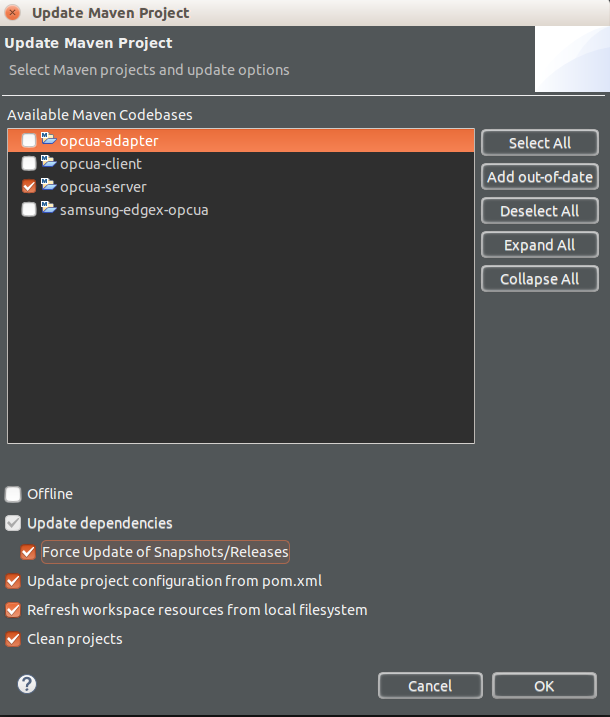

# How to test OPC-UA Sample Application

## Reference

- Run `./build.sh.`
  You can get OPC-UA Server/Client jar file in taret folder.
  
## Build
### How to build sample application in command line

1. Environment : Ubuntu 16.04 (64bit)

2. In *protocol-opcua-java/example*, run `./build.sh` in command line

   

3. You can execute opcua-client/opcua-server sample with
   
   `java -jar target/opcua-server-0.0.1-SNAPSHOT-jar-with-dependencies.jar`
   
   `java -jar target/opcua-client-0.0.1-SNAPSHOT-jar-with-dependencies.jar` in each command window

   

### How to build sample application with Eclipse

1. Environment : Eclipse

2. make project
   File - Import -Existing Maven Project - next
     -> select Root Directory in your source directory : *protocol-opcua-java/edge-opcua*
     -> finish

3. make project
   File - Import -Existing Maven Project - next
     -> select Root Directory in your source directory : *protocol-opcua-java/example*
     -> finish

4. You can build on each java file which has main() and run as 'java application' in opcua-client/opcua-server

5. Reference : If you have errors in pom.xml, Select Project -> Click Right button 
                  -> Maven -> Update Maven Project -> Check 'Force Update of Snapshots/Releases' -> OK

   
  
## Test

### 1. Execute *OPC-UA Server*  
   command : `java -jar target/opcua-server-0.0.1-SNAPSHOT-jar-with-dependencies.jar`
   
   

   *start* : start opcua server / create Node  -> first of all, you should input this command for testing

   *getnode* : get information of created node currently

   *getnode2* : get information of created node with browse name

   *quit* : termiate server

   *help* : print menu
 
### 2. Execute *OPC-UA Client*  
   command : `java -jar target/opcua-client-0.0.1-SNAPSHOT-jar-with-dependencies.jar`

   

   *start* : start opcua client / connect with opcua server / intialize Service Provider

   *quit* : terminate client

   *provider* : get providers name of created node currently

   *browse* : browse all node using root node

   *browse_m* : multiple browse with several nodes

   *read_s* : read value attribute for server node

   *read_t* : read value attribute for target node

   *read_gp* : multiple read value attribute for nodes

   *write* : write attribute into node

   *write_gp* : multiple value write attributes into nodes

   *sub* : subscription(1ms)

   *sub_modify* : modfiy subscription

   *sub_delete* : delete subscription

   *endpoint* : get endpoint lists from opcua server

   *auto* : run test automatically

   *help* : print menu
 
### 3. Start Server  
   input `start` and then, input `Your IP Address` in **OPC-UA Server**.
   
   
   Then start *OPC-UA Server*. And create service node.
   
 
### 4. Start Client  
   input `start` and then, input `opc.tcp://[OPC-UA Server's IP Addreess]/edge-opc-server` in **OPC-UA Client**.
   
   
   Then, *OPC-UA Client* connects with *OPC-UA Server*.  
   And Create service provider
   
   
   And, Show *the alias of the Provider*
   
 
### 5. Read Command 
   input `read_t` and then, input the alias of the Provider which indicate target Node. (refer. *Provider ValueAlias's List*). 
   Then read server node. 
   
      
### 6. Write Command 
   input `write` and then, input the alias of the Provider which indicate target Node. 
   Then write to server node. 
   
      
### 7. Monitoring  
   input `start CNC` in *OPC-UA Server*. 
   Then Run 'cnc100'
   
   
   input `sub` command in *OPC-UA Client*. And then, input the alias of the Provider which indicate target Node. 
   Then subscribe to server node.
   
   

