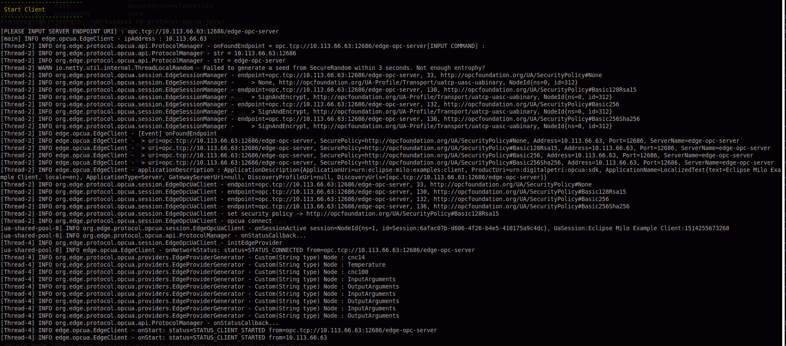
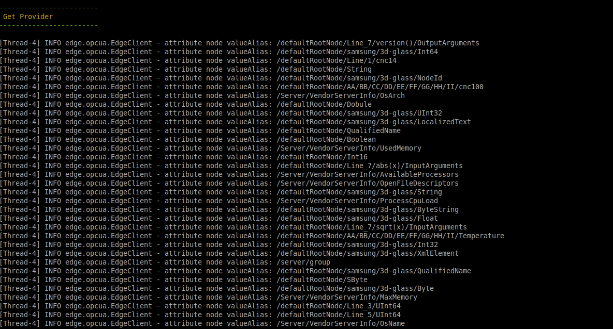

# How to test OPC-UA Sample Application

## Introduction

- It provides example codes of both client and server. It will be helpful usage of opcua stack library.
  
## Build
### How to build sample application in command line

1. Environment : Ubuntu 16.04 (64bit)

2. In *protocol-opcua-java/example*, run `./build.sh` in command line

   

3. You can find opcua-client, opcua-server sample application
   
   `java -jar target/opcua-server-0.0.1-SNAPSHOT-jar-with-dependencies.jar`
   
   `java -jar target/opcua-client-0.0.1-SNAPSHOT-jar-with-dependencies.jar` follwing below

   

### How to build sample application with Eclipse

1. Environment : Eclipse

2. Import opcua stack
   File - Import -Existing Maven Project - next
     -> select Root Directory in your source directory : *protocol-opcua-java/edge-opcua*
     -> finish

3. Import sample application
   File - Import -Existing Maven Project - next
     -> select Root Directory in your source directory : *protocol-opcua-java/example*
     -> finish

4. You can build source codes of the opcua stack and run as 'java application' in both opcua-client and opcua-server.

5. Reference : If you have some error related dependency in pom.xml. please update maven project following below.
               'Select Project' -> 'Click Right button' 
               -> 'Maven' -> 'Update Maven Project' -> Check 'Force Update of Snapshots/Releases' -> OK

   
  
## Test

### 1. Execute *OPC-UA Server*  
   command : `java -jar target/opcua-server-0.0.1-SNAPSHOT-jar-with-dependencies.jar`
   
   

   *start* : start opcua server / create Node  -> first of all, you should input this command for testing

   *getnode* : get node information

   *getnode2* : get node information with browse name

   *quit* : terminate server

   *help* : show menu
 
### 2. Execute *OPC-UA Client*  
   command : `java -jar target/opcua-client-0.0.1-SNAPSHOT-jar-with-dependencies.jar`

   

   *start* : start opcua client / connect with opcua server / intialize Service Provider

   *quit* : terminate client

   *provider* : get the provider list

   *browse* : browse all nodes with root node

   *browse_m* : multiple browse with several target nodes

   *read_s* : read attribute for server node

   *read_t* : read attribute for target node

   *read_gp* : multiple read attribute for target nodes

   *write* : write attribute to target node

   *write_gp* : multiple write attributes to nodes

   *sub* : subscription 

   *sub_modify* : modfiy subscription

   *sub_delete* : delete subscription

   *endpoint* : get endpoints from the server

   *auto* : run test automatically

   *help* : show menu
 
### 3. Start Server  
   input `start` and then, input `Your IP Address` in **OPC-UA Server**.
   
   
   Then start *OPC-UA Server*. And create nodes.
   
 
### 4. Start Client  
   input `start` and then, input `opc.tcp://[OPC-UA Server's IP Addreess]/edge-opc-server` in **OPC-UA Client**.
   
   
   Then, *OPC-UA Client* connect with *OPC-UA Server*.  
   And create service provider which indicate target node.
   
   
   And, Show *the alias of the provider*
   
 
### 5. Read Command 
   input `read_t` and then, input the alias of the provider which indicate target node. (refer getting *the alias of the Provider step*). 
   Then read attribute from server node.
   
      
### 6. Write Command 
   input `write` and then, input the alias of the provider which indicate target node. 
   Then write to the target node of the opcua server. 
   
      
### 7. Monitoring  
   input `start CNC` in *OPC-UA Server*. 
   Then update value of the 'cnc100' node
   
   
   input `sub` command in *OPC-UA Client*. And then, input the alias of the provider which indicate target node. 
   Then request subscription to target node. you can receive changed value from the target node.
   
   

